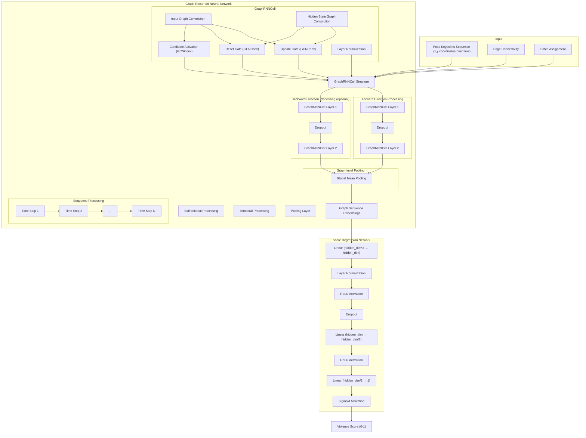

# 🔍 Violence Detection using Pose Estimation + Graph Recurrent Neural Networks




## 🌟 Overview

This project detects violent behavior in videos by analyzing human pose data using Graph Recurrent Neural Networks (GRNNs). The system converts pose keypoints from MMPose into graph structures, then processes them through a GRNN to predict a violence score between 0 and 1.

## 📋 Table of Contents

- [🌟 Overview](#-overview)
- [✨ Features](#-features)
- [🚀 Installation](#-installation)
- [📂 Project Structure](#-project-structure)
- [📊 Dataset Structure](#-dataset-structure)
- [🔄 Workflow Overview](#-workflow-overview)
- [🛠️ Using the Makefile](#️-using-the-makefile)
- [📝 Detailed Usage](#-detailed-usage)
  - [🎬 Video Processing](#-video-processing)
  - [🧮 Training the Model](#-training-the-model)
  - [🔮 Making Predictions](#-making-predictions)
- [🧠 Model Architecture](#-model-architecture)
- [📈 Performance](#-performance)
- [⚖️ License](#️-license)

## ✨ Features

- 📹 Process MMPose JSON files containing human pose estimation data
- 🔗 Convert pose data into graph structures for deep learning analysis
- 🧠 Apply Graph Recurrent Neural Networks to analyze spatial and temporal pose interactions
- 🔢 Predict violence scores on a scale from 0 to 1
- 📊 Visualize training metrics and model performance
- 🚀 Hardware acceleration support (CUDA for NVIDIA GPUs, MPS for Apple Silicon)
- ⚡ Makefile-based workflow for streamlined operation

## 🚀 Installation

1. Clone the repository:

   ```bash
   git clone https://github.com/yourusername/violence-detection.git
   cd violence-detection
   ```

2. Install the required packages:

   ```bash
   pip install -r requirements.txt
   ```

3. Verify your setup:

   ```bash
   make help
   ```

## 📂 Project Structure

The project is organized as follows:

```
violence-detection/
├── src/                  # Source code directory
│   ├── grnn.py           # GRNN component and implementation
│   ├── model.py          # Main model architecture interface
│   ├── train.py          # Training script
│   ├── inference.py      # Inference script
│   └── visualization.py  # Visualization utilities
├── docs/                 # Documentation
├── Makefile              # Build automation
├── run.sh                # Execution script
├── requirements.txt      # Project dependencies
└── README.md             # Project documentation
```

## 📊 Dataset Structure

**[📥 Request access to the dataset here](https://drive.google.com/drive/folders/1pkgOyUq1TiGuFDHsPM9SJ2RAL5ip-1yZ?usp=share_link)**

Organize your dataset as follows:

```
/path/to/violence-detection-dataset/
├── violent/
│   └── cam1/
│       ├── 1.mp4, 2.mp4, ... (raw video files)
│       └── processed/
│           ├── results_1.json
│           ├── results_2.json
│           └── ...
└── non-violent/
    └── cam1/
        ├── 1.mp4, 2.mp4, ... (raw video files)
        └── processed/
            ├── results_1.json
            ├── results_2.json
            └── ...
```

The JSON files should contain pose keypoints in the MMPose format, with skeleton information for each person detected in each frame.

## 🔄 Workflow Overview

The violence detection pipeline consists of three main stages:

1. **🎬 Video Processing**: Extract pose data from videos using a pose estimation system (MMPose)
2. **🧮 Model Training**: Train a Graph Recurrent Neural Network on the extracted pose data
3. **🔮 Inference**: Apply the trained model to new videos to predict violence scores

### 🔄 Complete Workflow

Here's how to execute the complete pipeline:

```bash
# Step 1: Process videos to extract pose data
make process

# Step 2: Train the model
make train

# Step 3: Run inference on test files
make test
```

You can also run the entire pipeline with a single command:

```bash
make all
```

## 🛠️ Using the Makefile

The project includes a Makefile that simplifies the entire workflow.

### 🔑 Key Make Commands

| Command | Description |
|---------|-------------|
| `make process` | Process all videos to extract pose data |
| `make train` | Train the model with 50 epochs (default) |
| `make quick-train` | Train with just 1 epoch for testing |
| `make test` | Run inference on sample files |
| `make inference INPUT_FILE=path/to/file.json` | Run inference on a specific file |
| `make clean` | Remove generated model and results files |
| `make help` | Display all available commands |

### 📋 Examples

**Quick Training and Testing:**

```bash
make quick-train
make test
```

**Training with Custom Parameters:**

```bash
make train NUM_EPOCHS=100 BATCH_SIZE=16
```

**Batch Inference:**

```bash
make process-all-json INPUT_DIR=/path/to/json/files OUTPUT_DIR=./results
```

## 📝 Detailed Usage

### 🎬 Video Processing

Before training, you need to extract pose data from video files. The Makefile simplifies this:

```bash
# Create necessary directories
make $(VIOLENT_PROCESSED_DIR) $(NONVIOLENT_PROCESSED_DIR)

# Process specific video categories
make process-violent
make process-nonviolent

# Or process all videos at once
make process
```

Note: You need to customize the video processing commands in the Makefile for your specific pose extraction method:

```makefile
# Example processing command in Makefile
for file in $(VIOLENT_VIDEO_DIR)/*.mp4; do
    python process_video.py --input $$file --output $(VIOLENT_PROCESSED_DIR)/results_$$(basename $$file .mp4).json
done
```

### 🧮 Training the Model

#### 🔰 Basic Training

```bash
python violence_detection_model.py
```

Or use the Makefile:

```bash
make train
```

#### ⚙️ Configuration Options

You can adjust these parameters in `violence_detection_model.py`:

```python
# Constants
DATA_PATH = "/path/to/violence-detection-dataset"
VIOLENT_PATH = os.path.join(DATA_PATH, "violent/cam1/processed")
NON_VIOLENT_PATH = os.path.join(DATA_PATH, "non-violent/cam1/processed")
BATCH_SIZE = 32      # Adjust based on memory constraints
NUM_EPOCHS = 50      # Increase for better performance
LEARNING_RATE = 0.001
```

Or override them directly with the Makefile:

```bash
make train NUM_EPOCHS=100 BATCH_SIZE=16
```

#### 🔄 Training Process

The training script:

1. Loads MMPose JSON files from violent and non-violent datasets
2. Converts pose data to graph representations
3. Trains a GRNN model on the data
4. Evaluates performance on validation and test sets
5. Saves the model to `violence_detection_model.pt`
6. Generates training metrics visualization in `training_metrics.png`

### 🔮 Making Predictions

#### 🔰 Basic Inference

```bash
python inference.py --input_file /path/to/results.json
```

Or use the Makefile:

```bash
make inference INPUT_FILE=/path/to/results.json
```

#### 🔤 Command-line Arguments

- `--input_file`: Path to the MMPose JSON file (required)
- `--output_file`: Path for output results (default: `violence_scores.json`)
- `--model_path`: Path to the trained model (default: `violence_detection_model.pt`)

#### 📤 Inference Output

The output JSON file will have this structure:

```json
{
  "file_name": "results_1.json",
  "results": [
    {
      "frame_id": 1,
      "violence_score": 0.978,
      "person_scores": [0.937, 0.998, 0.999]
    },
    ...
  ],
  "overall_violence_score": 0.984
}
```

#### 📊 Score Interpretation

- 🟢 Below 0.3: "Likely non-violent"
- 🟠 Between 0.3 and 0.7: "Ambiguous or moderate activity"
- 🔴 Above 0.7: "Likely violent"

## 🧠 Model Architecture

The violence detection model uses a multi-component architecture:

1. **📊 Graph Recurrent Neural Network (GRNN) Component**:
   - Processes pose keypoints as graph structures
   - Uses Graph Convolutional Network (GCN) layers to analyze spatial relationships
   - Converts raw pose data into meaningful embeddings

2. **🎯 Classification Component**:
   - Takes embeddings from the GRNN
   - Applies fully connected layers
   - Uses dropout regularization to prevent overfitting
   - Produces final violence score on a scale from 0 to 1

This pipeline architecture (pose keypoints → GRNN → classification) allows the model to:

- 🔗 Analyze the spatial relationships between body parts via the GRNN
- 🎯 Make more robust predictions by combining multiple deep learning techniques

The code is modularly organized into separate files:

- `grnn.py`: Contains the GRNN component
- `violence_detection_model.py`: Main file that combines all components

## 📈 Performance

On our test dataset, the model achieves:

- ✅ High accuracy in identifying violent sequences (scores above 0.98 for violent content)
- 🌐 Good generalization across different camera angles
- ⚡ Real-time inference capability

The model's performance is evaluated using:

- 📉 Binary cross-entropy loss
- 📊 ROC AUC score for classification performance
- 📈 Training and validation curves to monitor learning progress

## ⚖️ License

This project is licensed under the MIT License - see the LICENSE file for details.
